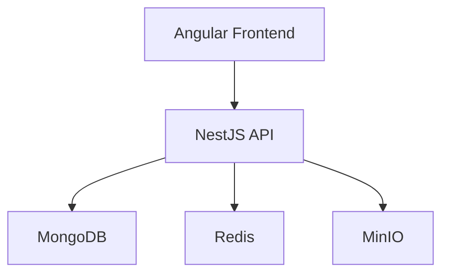
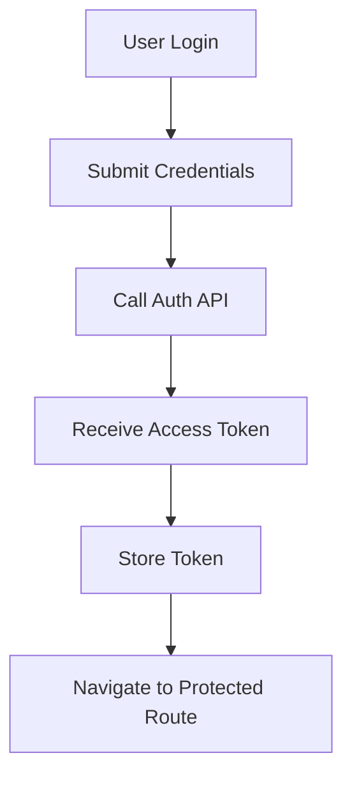
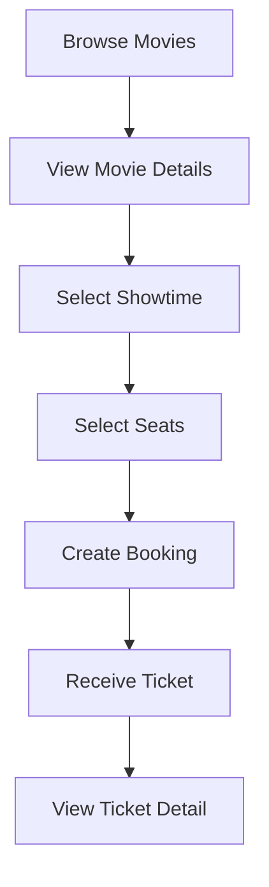

# 🎬 Full-Stack Developer Coding Challenge: Movie Ticket Booking System (Frontend)


This project is the frontend application for a movie ticket booking system, built with Angular to demonstrate modern SPA architecture, REST API integration, JWT-based authentication flows, seat booking interactions, and responsive UI development. It communicates with a NestJS backend that handles authentication, movie management, booking, ticket generation, and file storage.

## Features

### Authentication

- User Registration and Login
- Secure JWT-based Authentication

### Movie Browsing

- Browse Available Movies
- View Detailed Movie Information
- Search and Filter Movies

### Booking Experience

- Select Movie Showtimes
- Interactive Seat Reservation System
- Real-time Seat Availability Display

### Ticket Management

- View Booking History
- Access Ticket Details
- QR Code-Based Digital Tickets

### User Experience

- Responsive Design for Mobile, Tablet, and Desktop
- Modern and Intuitive User Interface
- Fast Navigation and Optimized Performance

## Tech Stack

- Angular 21
- TypeScript
- RxJS
- Angular Signals
- Angular Router
- Tailwind CSS
- Docker
- Nginx

## Project Highlights

- JWT-based authentication flow with protected routes
- Real-time seat selection UI integrated with backend booking APIs
- Admin dashboard for movie management
- PDF ticket export flow integrated with backend-generated tickets
- Angular Signals + RxJS based state handling
- Dockerized frontend deployment with Nginx

## Frontend Architecture

The application is structured as a single-page application (SPA) built with Angular.

Key frontend architectural concepts used in this project:

- Standalone Angular components
- Feature-based separation of pages, layouts, and services
- Service-based API integration with `HttpClient`
- JWT authentication flow with route protection
- HTTP interceptors for token attachment and request handling
- Angular Signals and RxJS for reactive state management
- Lazy-loaded routes for better performance
- Responsive UI built with Tailwind CSS

## Data Flow & API Integration

The frontend communicates with the backend through Angular services built on top of `HttpClient`.
Core integration patterns used in this project:

- Centralized API services for authentication, movies, bookings, and user data
- `HTTP Interceptors` for attaching JWT access tokens to protected requests
- `Route Guards` for authenticated and admin-only pages
- `Angular Signals` and `RxJS` for local and reactive UI state handling
- Environment-based API configuration for development and production

## Architecture Diagram



## Authentication Flow



## Booking Flow



## Project Structure

```text
src/
└── app/
    ├── layouts/
    │   ├── auth-layout/
    │   └── main-layout/
    ├── pages/
    │   ├── home/
    │   ├── login/
    │   ├── register/
    │   ├── booking/
    │   ├── ticket/
    │   ├── ticket-detail/
    │   └── admin-dashboard/
    └── services/
        ├── auth/
        ├── booking/
        ├── movies/
        └── user/
```

## Requirements

- Node.js >= 22
- npm >= 11

## Installation

Clone repository

```bash
git clone https://github.com/codeBrewer216/AIS-test-FE.git
cd AIS-test-FE
```

Install dependencies

```bash
npm install
```

## Environment Configuration

Update `src/environments/environment.ts`:

```ts
export const environment = {
  production: false,
  apiUrl: 'http://localhost:8000',
};
```

For production:

```ts
export const environment = {
  production: true,
  apiUrl: 'https://api.example.com/api',
};
```

## Run Development

```bash
npm start
```

or

```bash
ng serve
```

Application runs at:

```text
http://localhost:4200
```

## Build Production

Recommended (client-only, skips SSR/prerender):

```bash
npm run build:client
```

Build files will be generated in:

```text
dist/browser/
```

## Docker

Build image

```bash
docker build -t movie-booking-frontend .
```

Run container (map host 4200 to container 4200)

```bash
docker run -p 4200:4200 movie-booking-frontend
```

Open browser

```text
http://localhost:4200
```

## Docker Compose

```bash
docker compose up --build -d
```

## API Integration

Example backend endpoints used by the frontend:

| Method | Endpoint                | Description                   |
| ------ | ----------------------- | ----------------------------- |
| POST   | /auth/login             | Login                         |
| POST   | /auth/logout            | Logout                        |
| GET    | /auth/me                | Get current user profile      |
| POST   | /booking                | Create booking                |
| GET    | /booking/:id            | Get booking detail            |
| GET    | /booking/user           | Get user booking history      |
| GET    | /booking/:id/export-pdf | Export ticket PDF             |
| GET    | /movies                 | Get movies                    |
| GET    | /movies/:id             | Get movie detail              |
| GET    | /movies/:id/showtimes   | Get movie showtimes           |
| POST   | /storage/upload         | Upload file to object storage |

## Performance Optimization

- Lazy Loading Routes
- Angular Signals
- Standalone Components
- OnPush Change Detection
- HTTP Interceptors

## Test Coverage

```Bash
npm run test
```

## Future Improvements

- Advanced ticket reservation flow
- Booking cancellation support
- PWA support
- Payment gateway integration
- SSL / HTTPS production setup
- CI/CD deployment pipeline
- Kubernetes deployment
- Uptime monitoring with Uptime Kuma
- SEO optimization

## Snapshot

### Homepage (Before Login)

<figure>
  
  <figcaption>Homepage before login</figcaption>
</figure>

### Homepage (Logged In)

<figure>
  
  <figcaption>Homepage after login</figcaption>
</figure>

### Admin

<figure>
  
  <figcaption>Admin dashboard</figcaption>
</figure>

#### Add Movie

<figure>
  
  <figcaption>Add movie form</figcaption>
</figure>

#### Edit Movie

<figure>
  
  <figcaption>Edit movie form (step 1)</figcaption>
</figure>

<figure>
  
  <figcaption>Edit movie form (step 2)</figcaption>
</figure>

#### Delete Movie

<figure>
  
  <figcaption>Delete movie confirmation dialog</figcaption>
</figure>

### Booking

<figure>
  
  <figcaption>Booking page</figcaption>
</figure>

#### Select Movie

<figure>
  
  <figcaption>Browse movies</figcaption>
</figure>

#### Select Showtime

<figure>
  
  <figcaption>Select showtime slot</figcaption>
</figure>

#### Select Seats

Users can select available seats in real time before confirming the booking.

<figure>
  
  <figcaption>Select seats</figcaption>
</figure>

#### Confirm Reservation

Users can review and confirm their reservation before submitting the booking.

<figure>
  
  <figcaption>Confirm reservation</figcaption>
</figure>

#### Already Booked

<figure>
  
  <figcaption>Already booked seats</figcaption>
</figure>

### Ticket

<figure>
  
  <figcaption>Ticket list</figcaption>
</figure>

#### Ticket Detail

<figure>
  
  <figcaption>Ticket detail</figcaption>
</figure>

#### Ticket

[📄 View Ticket PDF](public/pdf/ac5f85c0-7f1c-4357-95c8-5c79eb9c909a.pdf)

## Demo

The demo video walks through the core user and admin flows of the application, including:

- user registration and login
- movie browsing and showtime selection
- seat reservation flow
- admin movie management
- ticket history and ticket detail

[📄 Watch Demo Video](https://youtu.be/ui-hHi4sBug)

## Related Backend

Backend repository for this project:

- [Movie Ticket Booking Backend (NestJS)](https://github.com/codeBrewer216/AIS-test-BE)

## License

MIT License

## Author

**Pongsapuk Sawaroj**
Full-Stack Developer

- GitHub: https://github.com/codeBrewer216
- Email: pongsapuk.sawarote@gmail.com
- LinkedIn: https://www.linkedin.com/in/pongsapuk-sawaroj-043541289/
