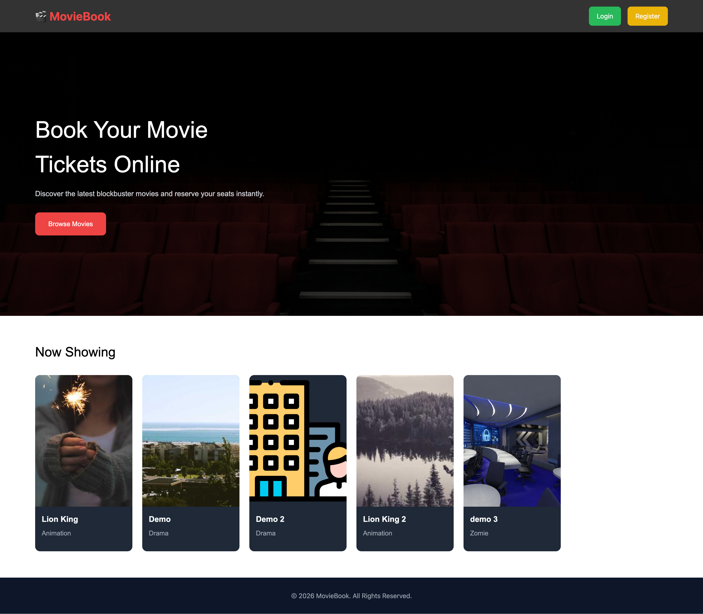
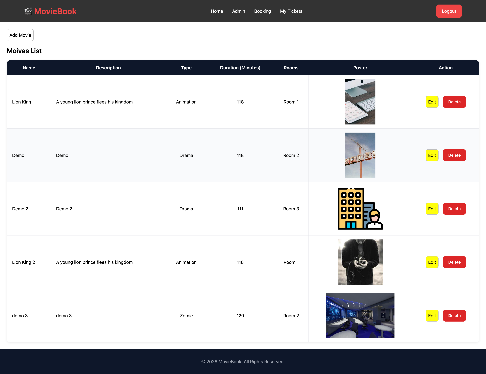
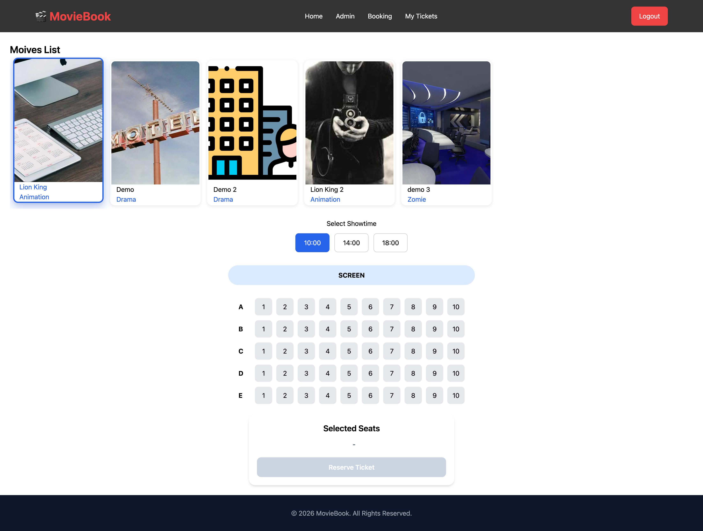
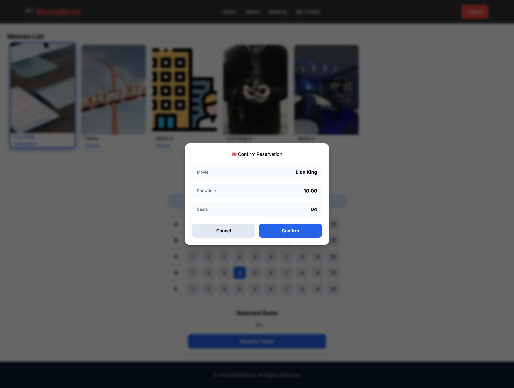
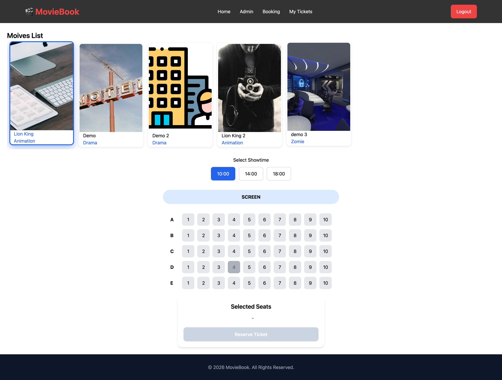

# 🎬 Full-Stack Developer Coding Challenge: Movie Ticket Booking System



Frontend application สำหรับระบบจองตั๋วภาพยนตร์ พัฒนาด้วย Angular และเชื่อมต่อกับ REST API Backend

## Features

- Authentication (Login / Register)
- Browse Movies
- View Movie Details
- Select Showtime
- Seat Reservation
- Ticket History
- Responsive Design
- QR Code Ticket

## Tech Stack

- Angular 21
- TypeScript
- RxJS
- Angular Signals
- Angular Router
- Tailwind CSS
- Docker
- Nginx

## Project Structure

```text
├── src/
│    ├── app/
│    │   ├── layouts/
│    │   │   ├── auth-layout/
│    │   │   ├── main-layout/
│    │   ├── pages/
│    │   │   ├── admin-dashboard/
│    │   │   ├── booking
│    │   │   ├── home/
│    │   │   ├── login/
│    │   │   └── register/
│    │   │   ├── ticket
│    │   │   ├── tecketdetail
│    │   ├── services/
│    │   │   ├── auth/
│    │   │   ├── booking/
│    │   │   ├── movies
│    │   │   ├── user
│    │   │   ├── login/
│    │   │   └── register/
│    ├── environments/
│    │   └── environment.ts
│    │
│    ├── assets/
│    ├── environments/
│    └── styles.css
│    ├── docker-compose.yml
│    ├── Dockerfile
│    ├── nginx.conf
```

## Requirements

- Node.js >= 22
- npm >= 11

## Installation

Clone repository

```bash
git clone https://github.com/codeBrewer216/AIS-test-FE.git
cd AIS-test-FE
```

Install dependencies

```bash
npm install
```

## Environment Variables

Edit environment file
Path: src/environments/environment.ts

```typescript
export const environment = {
  production: false,
  apiUrl: 'http://localhost:8000',
};
```

Production

```typescript
export const environment = {
  production: true,
  apiUrl: 'https://api.example.com/api',
};
```

## Run Development

```bash
npm start
```

or

```bash
ng serve
```

Application runs at:

```text
http://localhost:4200
```

## Build Production

Recommended (client-only, skips SSR/prerender):

```bash
npm run build:client
```

Build files will be generated in:

```text
dist/browser/
```

## Docker

Build image

```bash
docker build -t movie-booking-frontend .
```

Run container (map host 4200 to container 4200)

```bash
docker run -p 4200:4200 movie-booking-frontend
```

Open browser

```text
http://localhost:4200
```

## Docker Compose

```bash
docker compose up --build -d
```

## API Integration

Example API endpoints:

| Method | Endpoint              | Description       |
| ------ | --------------------- | ----------------- |
| POST   | /auth/login           | Login             |
| POST   | /auth/logout          | Logout.           |
| POST   | /bookings             | Create Booking    |
| GET    | /bookings/:id         | Find Booking Data |
| GET    | /bookings/printTicket | User Tickets      |
| GET    | /movies               | Get Movies        |
| PUT    | /movies/:id           | Edit Movies       |
| DELETE | /movies/:id           | Delete Movie      |
| GET    | /movies/:id/showtimes | Movies Detail     |
| POST   | /storage/upload       | Upload Image      |

## Performance Optimization

- Lazy Loading Routes
- Angular Signals
- Standalone Components
- OnPush Change Detection
- HTTP Interceptors

## Implement Plan

1. จองตั๋วล่วงหน้า
2. ยกเลิกตั๋วที่จองแล้ว
3. PWA Implement
4. Payment Gateway
5. SSL Verification
6. CI/CD Deployment Pipeline
7. SEO

## Snapshot

### Homepage (Not Login Yet)

{ width=720 }

### Homepage (Already Login )

{ width=720 }

### Admin

{ width=720 }

#### Add Movie

{ width=720 }

#### Edit Movie

{ width=720 }
{ width=720 }

#### Delete Movie

{ width=720 }

### Booking

{ width=720 }

#### Select Movie

{ width=720 }

#### Select Showtime

{ width=720 }

#### Select Seats

{ width=720 }

#### Confirm Reservation

{ width=720 }

#### Already Booked

{ width=720 }

### Ticket

{ width=720 }

#### Detail

{ width=720 }

#### Ticket

[📄 View Ticket PDF](public/pdf/ac5f85c0-7f1c-4357-95c8-5c79eb9c909a.pdf)

## Author

Pongsapuk Sawaroj

Full Stack Developer

GitHub: https://github.com/your-github
